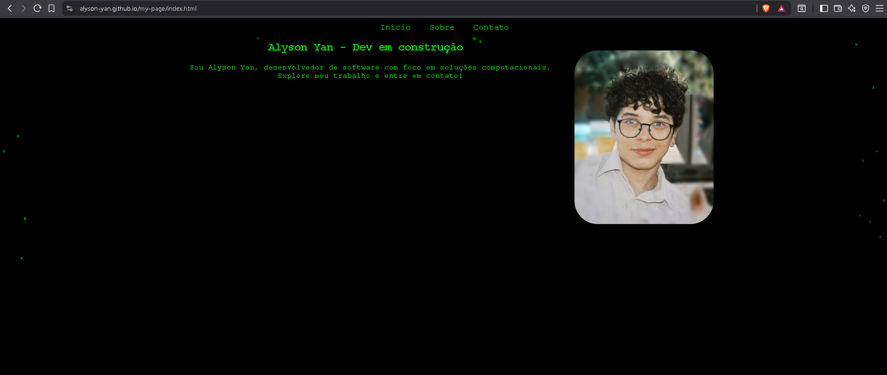

# 🌐 My Page — Site pessoal de Yan Fernandes

Bem-vindo ao repositório do meu site pessoal!

---
## 🚀 Demonstração

🔗 **Acesse aqui:** [https://alyson-yan.github.io/my-page](https://alyson-yan.github.io/my-page)

---

## 🧠 Sobre o projeto

Este site foi desenvolvido como um **projeto pessoal e portfólio**, com o objetivo de:
- Apresentar informações sobre mim e meus projetos;
- Servir como base de aprendizado em HTML, CSS e JS;
- Mostrar boas práticas de organização de código e design limpo.

---
## 🏗️ Tecnologias utilizadas

- **HTML5** — Estrutura e semântica;
- **CSS3** — Estilos e responsividade;
- **JavaScript (ES6)** — Efeitos e interatividade;
- **GitHub Pages** — Hospedagem gratuita.

---

## 📁 Estrutura do repositório

🧩 Melhorias futuras

 Otimizar imagens para WebP;

 Adicionar responsividade completa;

 Implementar animações suaves no scroll;

🧑‍💻 Autor

Yan Fernandes
🎮 Geek, desenvolvedor e praticante de jiu-jitsu.
📫 Contato: [text](https://www.linkedin.com/in/alyson-yan-sampaio-fernandes-92b78235b)
